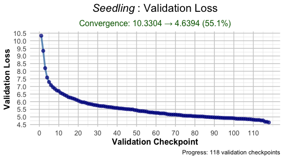

**AI for Psychological Measurement**

This repository contains deep learning experiments associated with my evolving book on AI for psychological measurement, available for free at https://psychometrics.ai. I have used AI assistance to better understand deep learning models that I explain how to use in psychological measurement contexts. 

So far, the repo includes:
- New methods inc. **Semantic Item Alignment**, **Pseudo-Factor-Analysis** and **LLM Convex Hulls**,
- A **decoupled reconstruction of a MiniLM encoder** with high precision decimal matching,
- A **decoupled reconstruction of the GPT-2 small decoder** with high precision decimal matching,
- The code for **Seedling**, an LLM coded from the ground up for education purposes.
- **RAG item generation** using IPIP database for context injection (includes Re-ranking).
- **Explainable AI (XAI)** permutation test example (see psychometrics.ai for XAI limitations with decoders)

**Seedling** is a GPT-2–style, ~51 million parameter LLM, coded from scratch in PyTorch with AI assistance. You can read more about its architecture and development process on the book's website. The name Seedling reflects both the early inchoate state of this model (loss = 4.63) and the hope that with a bit of TLC, this model will become a strong educational resource for quantitative psychologists. While the loss is still high, the smaller model size and single-file design (with separate testing script) make it accessible. 

Next steps could include modularizing the code like Andrej Karpathy’s excellent examples (although the single script is accessible as a beginner) and trying optimizations. Potential optimziations might include adjusting the learning rate, attempting learning rate restarts, changing the vocab size to the nearest multiple of 64 after 50k to ensure tensor alignment, and expanding the architecture deeper (more layers) and wider (more dimensions), both with and without greater data exposure. These changes are feasible to try while maintaining the low budget.

Licensing

Book Content: The text, examples, and educational materials in this book are shared under a Creative Commons Attribution-NonCommercial 4.0 International License (CC BY-NC 4.0). You're welcome to use the ideas, methods, and concepts in your own work, whether that's product development, internal tools, client services, or research. All I ask is that you don't sell or repackage this content as-is, and you credit psychometrics.ai when using it:

Guenole, N. (2025). Psychometrics.ai: AI for Psychological Measurement. https://psychometrics.ai.

Software Code: All code examples, scripts, and software tools are licensed under the MIT License, allowing you to use, modify, and distribute them freely in both commercial and non-commercial projects.

